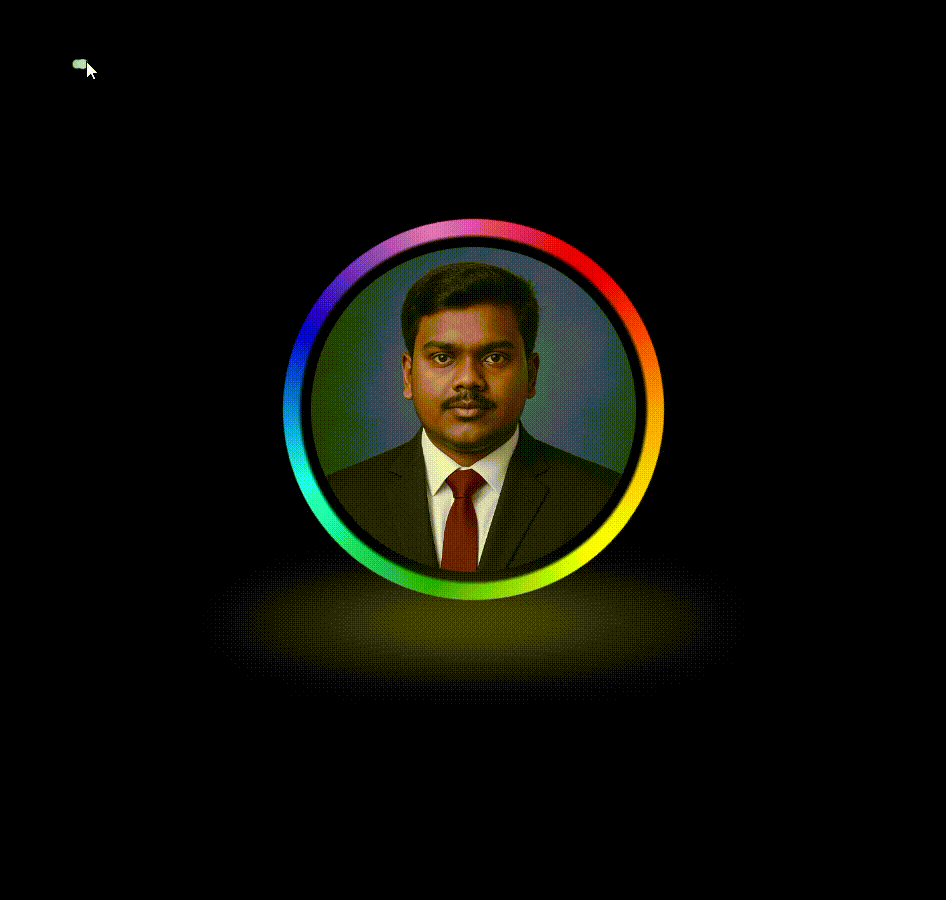

# 🌟 Animated Intro Page with Rotating Color Ring & Cursor Trail

Welcome to my interactive and animated **Intro Page** project! This webpage is built using **HTML**, **CSS**, and **JavaScript**, and is designed to serve as a visually appealing entry point to your personal website or portfolio.

---

## ✨ Features

- 🔵 **Animated Circular Profile Image**: A glowing, spinning conic-gradient ring surrounds your profile image.
- 🌈 **Color Rotation**: Smooth clockwise rotation with scale breathing effects.
- 💨 **Glowing Shadow Effect**: Elegant pulsing shadows create a modern look.
- 🖱️ **Cursor Trail Animation**: Fading dots follow the cursor to enhance interactivity.
- 📱 **Responsive Design**: Fully responsive and centered layout on all screen sizes.
- 🎯 **Click-to-Redirect**: Clicking the profile image redirects to your GitHub profile.

---

## 📸 Preview

---

## 🛠️ Technologies Used

- **HTML5**
- **CSS3 (Animations, Flexbox, Gradients)**
- **JavaScript (DOM manipulation, Event listeners)**

---

## 📂 File Structure

- **/your-project-folder**
- **├── index.html # Main HTML file**
- **├── styles.css # CSS for layout and animations**
- **├── cursors.js # JavaScript for cursor trail animation**
- **├── Capture.PNG # Your profile image**

---

## 🚀 How to Run

1. Clone this repository or download the ZIP.
2. Make sure the image file `Capture.PNG` is placed in the root folder.
3. Open `index.html` in your browser.
4. Click the image to be redirected to your GitHub profile.

---

## 📎 Customization

- 🔗 Change the `href` in the anchor tag to link to your website or social media.
- 📷 Replace `Capture.PNG` with your own image.
- 🎨 Customize the gradient colors or animation speeds in `styles.css`.

---

## 📌 GitHub

🔗 [Visit My GitHub Profile](https://github.com/SadeHarshaVardhan)

---

## 💬 Feedback

Have suggestions or want to collaborate? Feel free to open an issue or connect via GitHub!

---

🧠 *Made with creativity and code by HarshaVardhanSade.*
